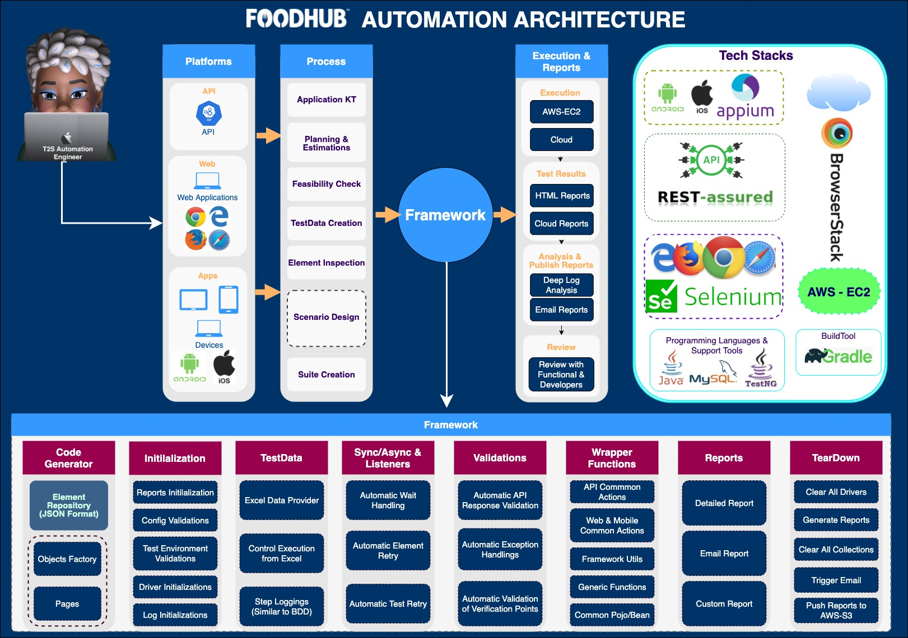

# Test Automation Instructions

## Table of Contents

 - [SoftwareComponents](#SoftwareComponents)
 - [FrameworkStructure](#FrameworkStructure)
 - [AutomationTestSetupRules](#AutomationTestSetupRules)
 - [LocatorPriorities](#LocatorPriorities)
 - [WrapperMethods](#WrapperMethods)
 - [UsageOfCodeGenerator](#UsageOfCodeGenerator)
 - [TestReport](#TestReport)
 - [PullRequests](#PullRequests)
 - [APIDocumentation](#APIDocumentation)
 - [UbuntuSetupForMobileAutomation](#UbuntuSetupForMobileAutomation)
 - [OutOfScope](#OutOfScope)
 - [Contact](#Contact)

### SoftwareComponents

|	Component	| Version	   |	Usage	|	URL	|	
|	---	|------------| ---	|	---	|	
|	Gradle	| 	7.2	      |	Build Tool	|	https://gradle.org/install/	|
|	Java	| 	17	       |	Java JDK	|	https://www.oracle.com/java/technologies/javase/jdk17-archive-downloads.html	|
|	Selenium	| 	4.2.2	    |	Core Web Automation libray	|	It will auto download through build.gradle 	|
|	testNg		| 	7.5	      |	Core Libray to invoke Tests	  |	It will auto download through build.gradle	|
|	Extent Reports/aventstack	| 	5.0.9	    |	To Generate Reports	|	It will auto download through build.gradle	|
|	Eclipse/Intellij		| 	latest	   |	IDE	|	https://www.jetbrains.com/idea/download/	|
|	Appium	| 	2.0	      |	Mobile Automation	|	https://appium.io/docs/en/2.0/intro/	|
|	Android Studio	| 	2022.3.1	 |	For Android SDK and To use emulator for Android Automation	|	https://developer.android.com/studio	|
|	Xcode	| 	15	       |	For IOS Automation		|	https://developer.apple.com/xcode/	|
|	GitBash	| 	Latest	   |	For Git Shell		|	https://git-scm.com/downloads	|
|	GitHub Desktop	| 	Latest	   |	Git UI: For easy use of git navigations	|	https://desktop.github.com/	|

### FrameworkStructure

### AutomationTestSetupRules

1. Clone Project from https://github.com/uktech/testautomation_UI.git / https://github.com/uktech/testautomation_API.git
2. Launch Intellij and Import project as Gradle Project
3. Download Chrome Driver from below path and add it to src/test/resources/Utilities
https://chromedriver.chromium.org/downloads
4. Download FireFox Driver from below path and add it to src/test/resources/Utilities
https://github.com/mozilla/geckodriver/releases
5. Build the Project "gradle clean build"
6. If you are running for mobile, add .apk/.app/.ipa to src/test/resources/Utilities
7. Ensure that your project folder is not modified, it should be 't2s-Automationscript'
7. Perform gradle task : 'gradle task downloadFrameWork'
8. Generate code by performing task : 'gradle task codeGen'

Rules:
1. Always Execute Tests from Suite Level from the path src/test/resources/TestSuites
2. Make sure to provide below parameters in Suite file, refer web.xml 
       
        
parameter name="testType" value="web" 

        
parameter name="browser" value="chrome or firefox"

        
parameter name="browserVersion" value="76.6"

        
parameter name="webURL" value="https://foodhub-automation.t2sonline.com/"

        
parameter name="chromePath" value="src/test/resources/Utilities/chromedriver  or geckodriver path" 

3. One JSON file per page
4. One Page Class per JSON
5. Include all Page class objects in ObjectsFactory class.

### LocatorPriorities

|	Priority	| Web	|	Android	|	IOS	|	
|	---	|	---	| ---	|	---	|	
|	1	|	id	|	accessibilityid	|	accessibilityid	|
|	2	|	name	|	id	|	id	|
|	3	|	classname	|	uiautomator	|	uiautomator	|
|	4	|	linktext	|	name	|	name	|
|	5	|	css	|	xpath	|	xpath	|
|	6	|	xpath	|	datamatcher	|	datamatcher	|
|	7	|	partiallinktext	|   classname	|	classname	|
|	8	|	tagname	|	viewtag	|	viewtag	|
|	9	|		|	image	|	image	|
|	10	|		|	custom	|	custom	|
|	11	|		|	partiallinktext	|	partiallinktext	|
|	12	|		|	linktext	|	linktext	|
|	13	|		|	tagname	|	tagname	|
|	14	|		|	css	|	css	|

### WrapperMethods

|	Method Name	|	Return Value	|	TC Status	|	Logs In Report	|	Platforms	|	Usage	|
|	:---:	|	:---:	|	:---:	|	:---:	|	:---:	|	:---:	|
|	isPresent	|	TRUE - if the element is present  FALSE- if the element is NOT present	|	NOT FAIL	|	NO	|	Web,Mobile	|	Perform some action only if the element isPresent	|
|	isNotPresent	|	TRUE - if the element is present  FALSE- if the element is NOT present	|	FAIL - If element Present  PASS - if element isNotPresent	|	Yes	|	Web,Mobile	|	To Check Element presence and Log To Report	|
|	isNotDisplayed	|	TRUE - if the element is NOT Displayed  FALSE- if the element is Displayed	|	FAIL - If element is displayed  PASS - if element is NOT Displayed	|	Yes	|	Web,Mobile	|	To check invisibilty of Condition like, Element is present and also check if it is interactable or not	|
|	isEnabled	|	TRUE - if the element is Enabled  FALSE- if the element is NOT Enabled	|	FAIL - If element is NOT ENABLED  PASS - if element is ENABLED	|	Yes	|	Web,Mobile	|	To check if the element is enabled or not, also perform some actions only if element is enabled	|
|	isSelected	|	TRUE - if the element is Selected  FALSE- if the element is NOT Selected	|	FAIL - If element is NOT SELECTED  PASS - if element is SELECTED	|	Yes	|	Web	|	To check if the dropdown value is selected or not, also perform some actions only if the element selected	|

### UsageOfCodeGenerator
|	Parameter	| Usage	|	Additional Instructions	|		
|	---	|	---	| ---	|	
|	elementRepoPath	|	Location of the folder where the JSON files are available. 	|	Provide Only folder path	|	
|	javaClassPath	|	Location of the folder where the generated pages has to be stored. 	|	NA	|	
|	objFactoryPath	|	Location of the folder where the Object factory is generated.  	|	NA	|	
|	customObjFactory	|	Common actions classes of all the products seperated by comma.[FoodhubApicommonActions,FoodhubCommonActions]  	|	NA	|	
|	customObjFactory_package	|	Common actions packages of all the products seperated by comma.[com.t2s.commonactions.foodhub.FoodhubApicommonActions,             com.t2s.commonactions.foodhub.FoodhubCommonActions]	|	Provide Only folder path	|	

### TestReport

1. Test Reports will be stored in locally src/test/resources/TestResults. Also pushed to S3 Bucket
2. Test Report can be identified with your suitename along with Run date and time.

## APIDocumentation

[APIDocumentation.md](src/test/resources/README/APIDocumentation.md)

## UbuntuSetupForMobileAutomation

[UbuntuSetupForMobileAutomation.md](src/test/resources/README/UbuntuSetupForMobileAutomation.md)

### PullRequests

After creating a pull request, codepipeline will check that t2s-Automationscript and the automationframework library compile together.

- If a new version number of the automation library is published, modify this within the buildspec.yml.
- If a change is required to be published in this library, first publish the change, then run git commit --amend, git push -f to retrigger the pipeline check (ensure git branch mode is 'simple' - git config --global push.default simple) to only push the current branch.
- The PR Build can be viewed here:
https://eu-west-2.console.aws.amazon.com/codesuite/codebuild/192389957878/projects/TestSuite-PR

## OutOfScope

NA

## Contact

Incase of any issues, Please reach out at automation@foodhub.com

